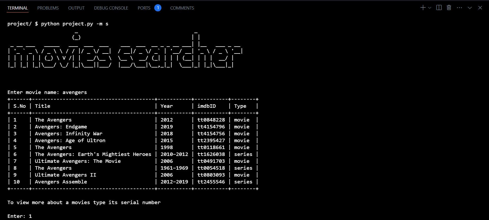
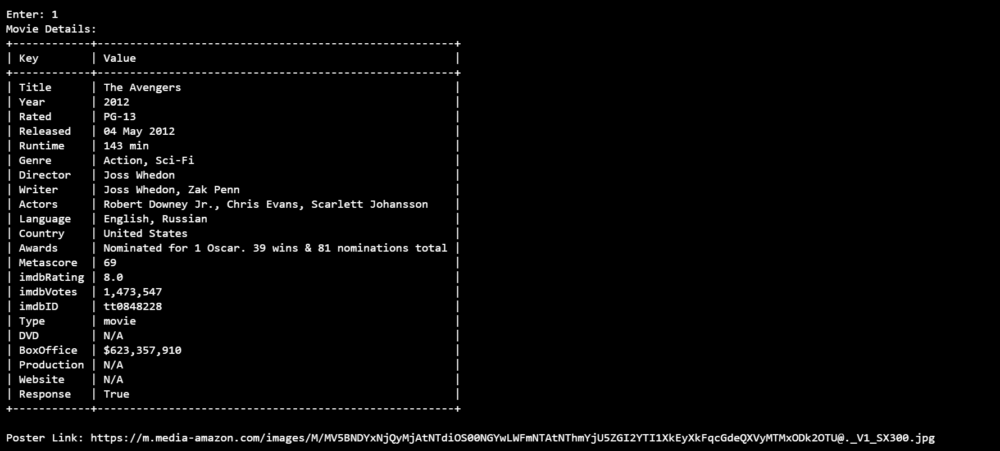
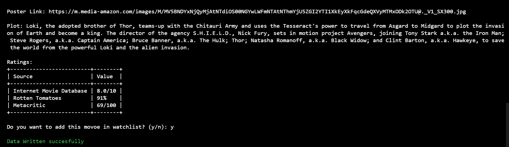
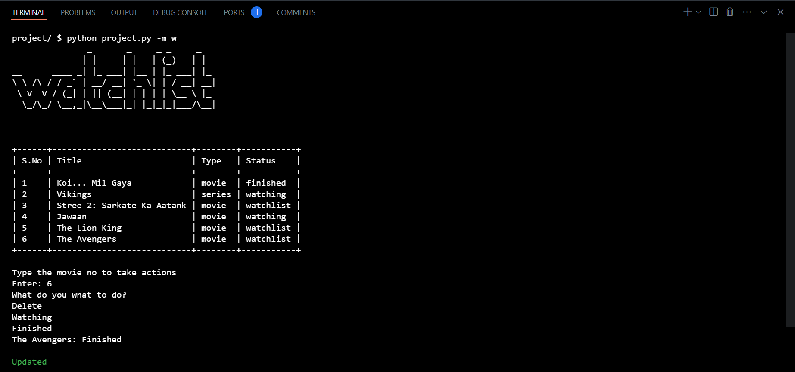

# Movies Manager

 A simple python script that let you search for movies, see its details and add to watchlist. It also has a watchlist mode to manage your watchlist.

## Table of Contents

- [Deployment](#deployment)
- [Usage](#usage)
  - [Preview of search mode](#preview-of-search-mode)
  - [Preview of watchlist mode](#preview-of-watchlist-mode)
- [Features](#features)
- [Tech Stack](#tech-stack)
- [Files](#files)
- [Authors](#authors)

## Usage

To use this project run

```bash
  python project.py -m [mode]
```
Modes -> 's' or 'search' and 'w' or 'watchlist'


# Demo
### [YouTube Video]()

## Preview of search mode




## Preview of watchlist mode

## Features

This python script boasts several user-friendly features:

- **It let you choose between `search` and `watchlist` mode:**
   - User can choose `search` mode to search for the movies details.
   - User can choose `watchlist` mode to manage thier watchlist.

- **`Search` Mode:**
   - User can provide movie name or keyword to search.
   - It gives a list of `10` best matches with many differenet details.
   - User can choose a particular movie to see more details.
   - Details contains all the different details with plot, ratings and a link to the poster.
   - User can add that movies to `watchlist` by typing `y` or `yes`.

- **`Watchlist` mode:**
   - User will get a list of saved movies with thier `Title`, `Type` and `Status` which can have `Watchlist`, `Watching` or `Finished` as values.
   - User can change the status and delete the movie using `cmd` user interface.


## Tech Stack

This project leverages the following technologies:

- **Libraries:**
    - `sys ` to acces functions like `exit()`.
    - `pyfiglet` to print the name of the mode using ASCII art.
    - `tabulate` to print the data in table format.
    - `csv` to read and write data in csv files.
    - `argparse` to get the arguments to choose between modes
    - `requests` to make web requests to fetch data using api.
    - `json` to handle the recieved in json format.
    - `colorama` to colour the output messages.
    - `pytest` to test the available functions.


- **API:**
    - `omdb` a free to use api privider for movies and tv shows.
- [OMDB website](https://www.omdbapi.com/)

### Project Structure

The project's code and resources are organized into the following directories:

**Root Directory (`app.py`):**

- `project.py`: Contains all the script with main function.

- `watchlist.csv`:Stores the data to implement watchlist.

- `test_project.py`: Tests few function in `project.py` using `pytest` library.

- `requirements.txt`: Stores th names of libraries used.


### Author

- [@sattyaaa](https://github.com/sattyaaa)


## Appendix

Ensure you have python and all the required libraries installed.

